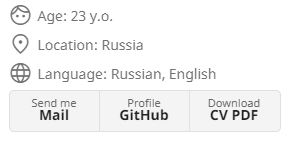

# [Fork from The Minimal theme](https://github.com/pages-themes/minimal) for my CV site

# Changes from original repo:

* Left-side changed to resume-style block

  

* Ability to add your site favicon

# Configurate you `_config.yml` or [see example](https://github.com/Annndruha/annndruha.github.io)

```yaml
fullname: Andrey Marakulin
favicon: /assets/images/favicon.svg
logo: /assets/images/photo.png

show_info: true
age: 23 y.o.
location: Russia
language: Russian, English

show_contacts: true
mailto: mailto:annndruha.github@gmail.com
cv_pdf_link: https://raw.githubusercontent.com/Annndruha/annndruha.github.io/main/pdf/cv_pdf.pdf

remote_theme: annndruha/minimal-resume
plugins:
- jekyll-remote-theme
```
